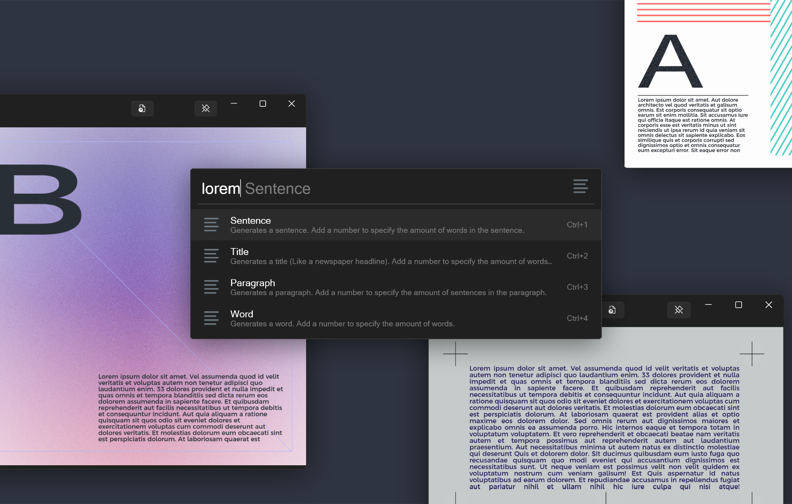
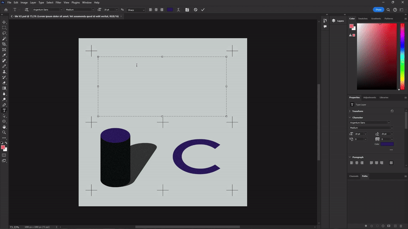

<p align="center" style="width: 70%; margin: 0 auto;"></p>


# Lorem Ipsum Generator

Generate Lorem Ipsum paragraphs / words / sentences from Flow Launcher.

Simply type `lorem` to start. Select what you want to generate. Add a number to specify the amount of ___ generated *(optional)*.

When I design I usually use Lorem Ipsum because I'm too lazy to write something myself. I usually go on a Lorem Ipsum generator I find on google, I wanted to remove the extra step, so I made this plugin that I could use from Flow Launcher. 

<p align="center"></p>

## ⌨️ Features

* Generate Words (custom amount of them in a string)
* Generate a Paragraph (custom amount of sentences in it)
* Generate a Sentence (custom amount of words in it)
* Generate a Title (custom amount of words in it)

<br>

## 📅 Planed Features
~~*I need to learn how to implement them first :)*~~

- [x] Setting default range / amount ...
- [ ] Subtype settings
- [ ] Legth range and precision
- [ ] Type specific settings
- [ ] More types that can be generated

<br>

# ⬇️ Installation:

### Flow Launcher:
Type this in the flow launcher and press enter.
```
pm install lorem
```

##
[](https://ko-fi.com/tomkliner)

Icons by [Icon8](https://icons8.com/)
